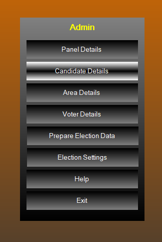
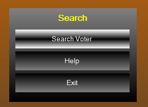
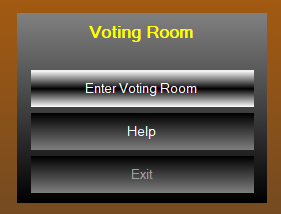
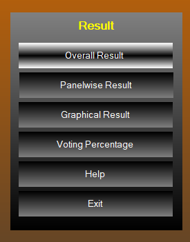
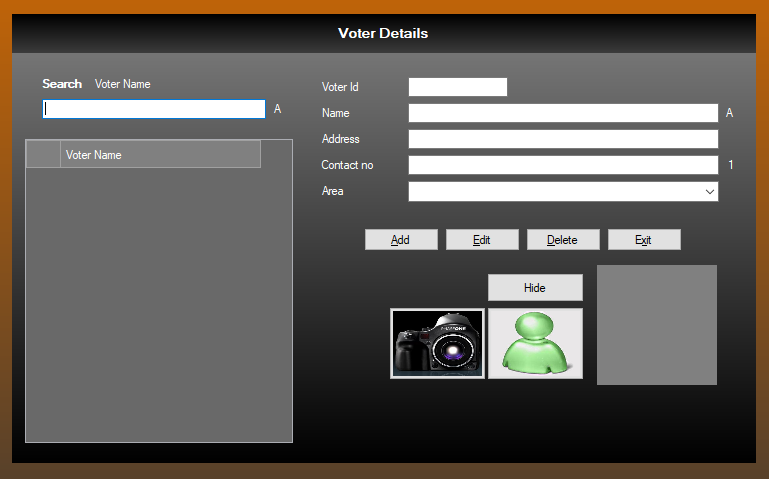

This is a simple C# windows forms application design createded using
Visual Studio 2019 Community Edition (.Net Framework 4.8), will be useful for beginners.
*This application is designed for beginners and college students for learning purpose.

This application is designed to experience the working of onling voting system,
using windows forms application. Application contains different modules such as Admin, 
Panel, Candidate, Voter, Election, Result etc.

Users can download and use it like ready templates and can implement logic as per their 
requirement and use dabases of their own choices like MS Access or MS SQL or My SQL etc.

-----

-----

# Apply For 

### Online C# Project Workshop For College Students
https://wa.me/p/8685551258164102/919765975757

### Free Project Guidance For College Students
https://wa.me/p/7965729696887851/919765975757

### Free Online Internship
https://wa.me/p/8277870308947674/919765975757
